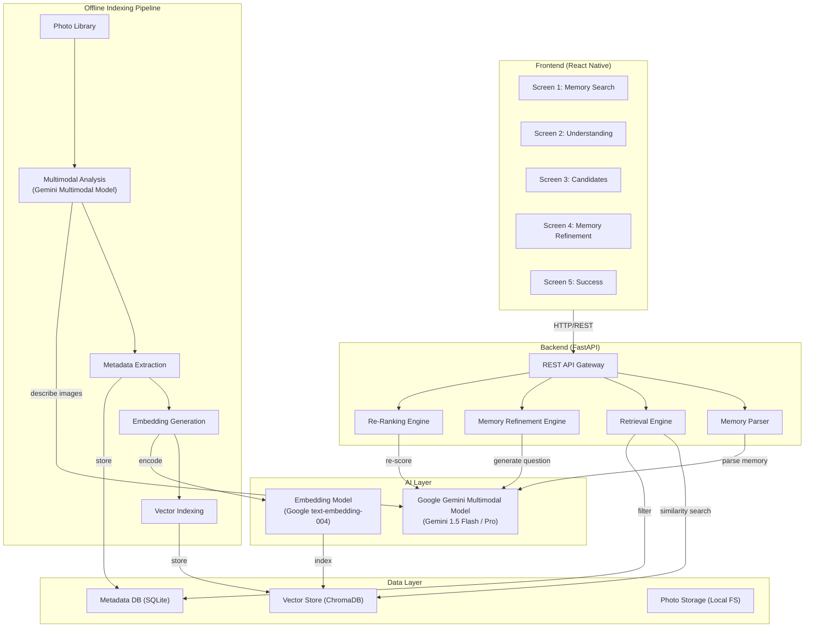
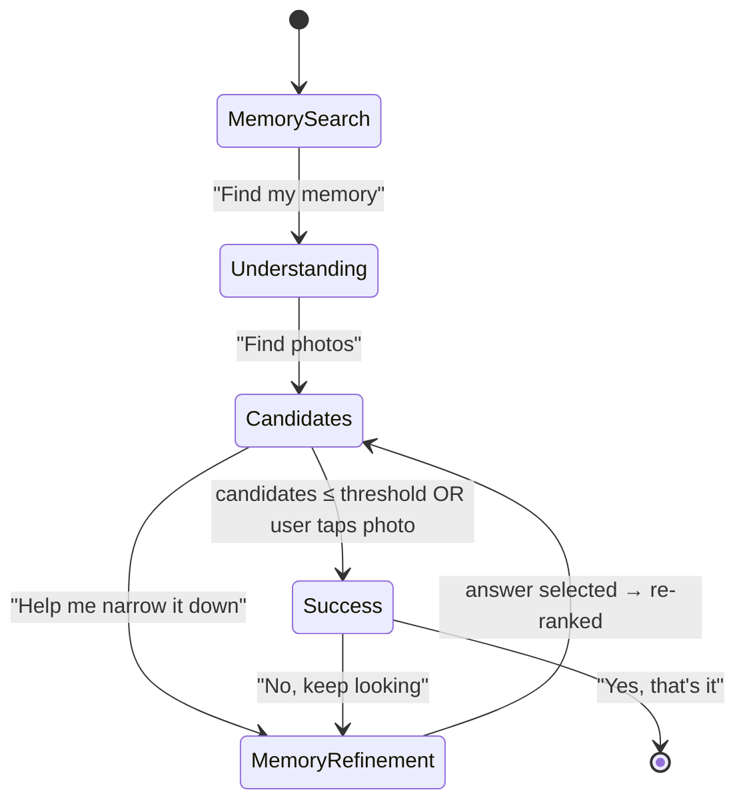
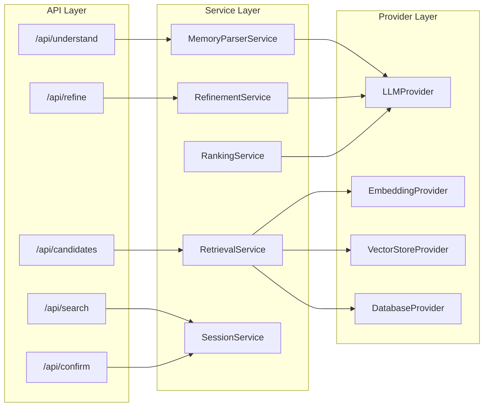
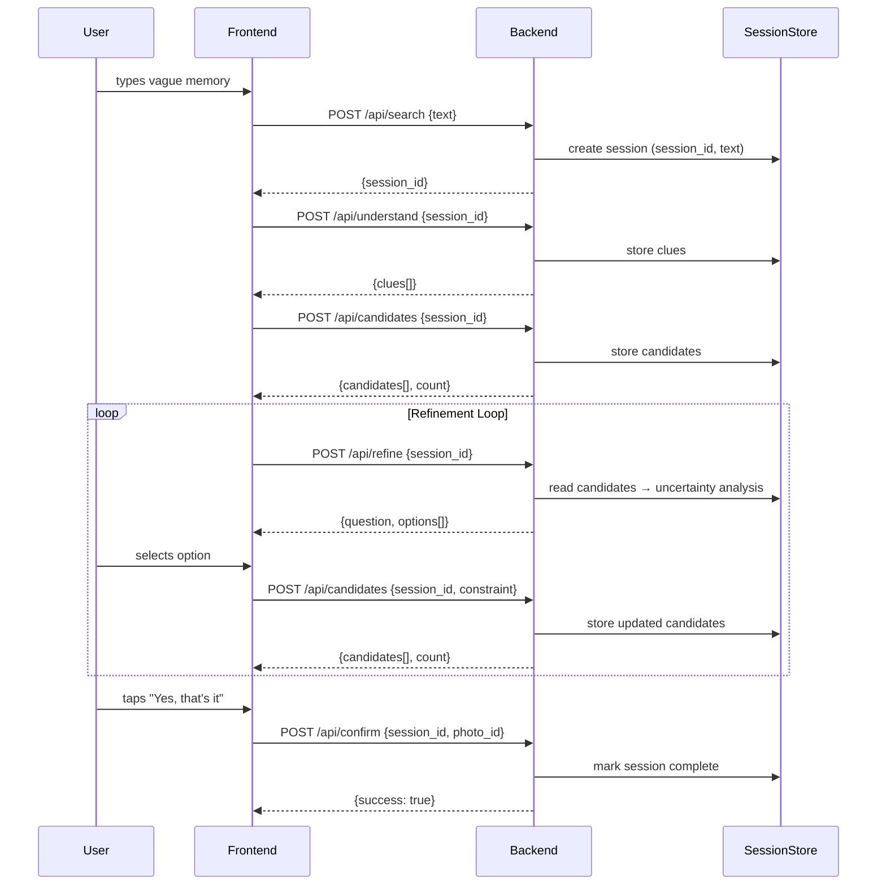
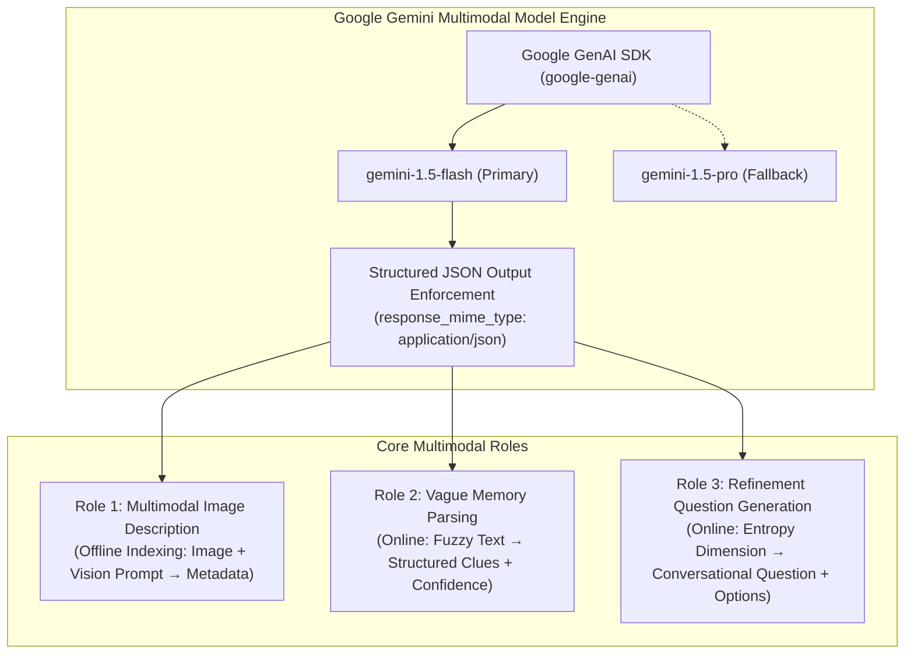
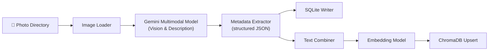
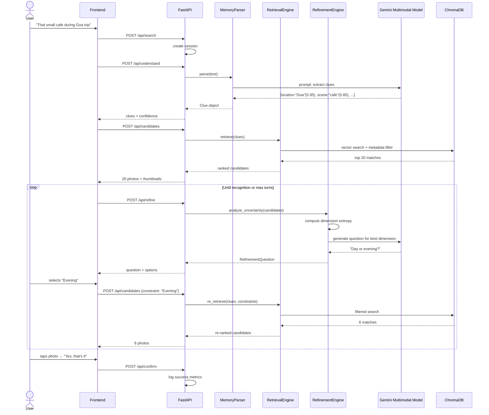
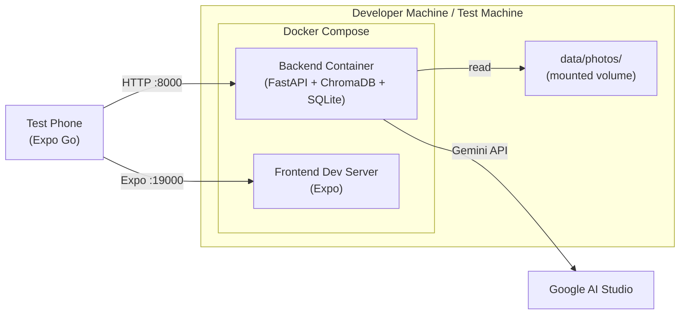

# ReMind — System Architecture

> Detailed technical architecture for the ReMind MVP.
> Derived from [`context.md`](file:///c:/Users/Mukta Kulkarni/OneDrive/Desktop/Google MVP/context.md)

---

## Table of Contents

1. [High-Level Architecture](#1-high-level-architecture)
2. [Technology Stack](#2-technology-stack)
3. [Component Deep-Dives](#3-component-deep-dives)
   - 3.1 [Frontend — React Native Mobile App](#31-frontend--react-native-mobile-app)
   - 3.2 [Backend — FastAPI Application Server](#32-backend--fastapi-application-server)
   - 3.3 [AI Layer — Multimodal LLM Services](#33-ai-layer--multimodal-llm-services)
   - 3.4 [Data Layer — Vector Store & Metadata DB](#34-data-layer--vector-store--metadata-db)
4. [Data Models](#4-data-models)
5. [Offline Indexing Pipeline](#5-offline-indexing-pipeline)
6. [Online Memory Reconstruction Loop](#6-online-memory-reconstruction-loop)
7. [API Contract](#7-api-contract)
8. [Uncertainty-Driven Refinement Engine](#8-uncertainty-driven-refinement-engine)
9. [Embedding Strategy](#9-embedding-strategy)
10. [Directory Structure](#10-directory-structure)
11. [Deployment Architecture](#11-deployment-architecture)
12. [Non-Functional Requirements](#12-non-functional-requirements)

---

## 1. High-Level Architecture



### Architectural Style

The MVP follows a **modular monolith** pattern — a single deployable backend with clearly separated internal modules. This keeps the MVP simple while allowing any module to be extracted into a microservice later.

| Layer | Responsibility |
|-------|---------------|
| **Frontend** | 5-screen mobile UI; captures user input, displays candidates, collects refinement answers |
| **Backend** | Orchestrates the memory reconstruction loop, manages sessions, calls AI services |
| **AI Layer** | Google Gemini Multimodal Model for image description, memory parsing, question generation; embedding model for vector representations |
| **Data Layer** | Persists photo metadata, embeddings, and raw photo files |

---

## 2. Technology Stack

| Layer | Technology | Rationale |
|-------|-----------|-----------|
| **Frontend** | React Native (Expo) | Cross-platform mobile; rapid prototyping; "lightweight mobile app" requirement |
| **Backend** | Python 3.11+ / FastAPI | Async-first, excellent ML/AI ecosystem, fast API development |
| **Multimodal LLM** | Google Gemini Multimodal Model (`gemini-1.5-flash` primary / `gemini-1.5-pro` fallback) | Native multimodal understanding (images + text), structured JSON output support, sub-second latency, generous free tier |
| **Embedding Model** | Google `text-embedding-004` (primary) or `all-MiniLM-L6-v2` (Sentence-Transformers) | High quality semantic embeddings; aligned with Gemini ecosystem |
| **Vector Store** | ChromaDB | Lightweight, embedded, Python-native, metadata filtering built in |
| **Metadata DB** | SQLite (via SQLAlchemy) | Zero-config, file-based, sufficient for 1 K photos |
| **Photo Storage** | Local filesystem | MVP simplicity; photos served via static file endpoint |
| **Task Queue** | (none — synchronous for MVP) | Offline pipeline runs as a one-shot CLI script |
| **Deployment** | Docker Compose | Single-command local setup; easy to hand off for user testing |

---

## 3. Component Deep-Dives

### 3.1 Frontend — React Native Mobile App

#### Screen Flow



#### Screen Details

| # | Screen | Component | Key Props / State |
|---|--------|-----------|-------------------|
| 1 | Memory Search | `<MemorySearchScreen>` | `userInput: string` |
| 2 | Understanding | `<UnderstandingScreen>` | `clues: Clue[]` (location, event, scene, people, time, visual_details with confidence scores) |
| 3 | Candidates | `<CandidatesScreen>` | `candidates: Photo[]`, `totalCount: number` |
| 4 | Memory Refinement | `<RefinementScreen>` | `question: string`, `options: string[]` |
| 5 | Success | `<SuccessScreen>` | `bestMatch: Photo`, `confirmed: boolean` |

#### State Management

- **React Context + `useReducer`** for session state (clues, candidates, refinement history).
- No external state library needed at MVP scale.

#### API Communication

- Axios HTTP client.
- Session ID header (`X-Session-Id`) to maintain refinement loop state server-side.

---

### 3.2 Backend — FastAPI Application Server



#### Internal Modules

| Module | Responsibility |
|--------|---------------|
| **`services/memory_parser.py`** | Sends user's vague text to LLM → receives structured clues with confidence scores |
| **`services/retrieval.py`** | Converts clues to an embedding query; runs vector similarity search + metadata filters; returns ranked candidate list |
| **`services/refinement.py`** | Implements the uncertainty-driven refinement engine (§8); asks LLM to generate a natural-language question |
| **`services/ranking.py`** | Re-scores candidates after each user answer by combining semantic similarity with new constraint |
| **`services/session.py`** | Manages per-search session state: original clues, accumulated constraints, candidate history, turn count |
| **`providers/llm.py`** | Thin wrapper around the Gemini API (prompt templates, retry, rate-limit) |
| **`providers/embedding.py`** | Generates embeddings via API or local model |
| **`providers/vectorstore.py`** | ChromaDB collection operations (add, query, filter) |
| **`providers/database.py`** | SQLAlchemy session factory for SQLite metadata store |

#### Session Lifecycle



---

### 3.3 AI Layer — Google Gemini Multimodal Model Services

The AI foundation of ReMind is built on the **Google Gemini Multimodal Model** family (primarily `gemini-1.5-flash` with `gemini-1.5-pro` as optional fallback). Gemini provides native end-to-end multimodal reasoning across both image and text modalities within a single model architecture, eliminating the need for separate computer vision classifiers, OCR engines, and text LLMs.



#### Why Google Gemini Multimodal Model?

1. **Native Multimodal Understanding:** Gemini was trained from inception across video, image, audio, and text modalities. In the offline pipeline, it reads raw image pixels directly alongside textual prompts to simultaneously extract semantic context, visual objects, environmental mood, lighting (time of day), and OCR in a single inference call.
2. **Guaranteed Structured JSON Outputs:** ReMind utilizes Gemini's native `response_mime_type="application/json"` and `response_schema` enforcement, ensuring all extractions strictly adhere to predefined Pydantic models with zero markdown hallucinations or JSON syntax errors.
3. **Low-Latency Interactive Inference:** `gemini-1.5-flash` delivers typical response times under 1.5 seconds, ensuring the interactive 5-screen reconstruction loop remains responsive and seamless on mobile devices.
4. **Massive Context & Cost Efficiency:** Generous rate limits and cost-effective batch pricing make it ideal for indexing libraries of 500–1,000 photos and executing multi-turn user refinement dialogues.

---

#### Detailed Gemini Multimodal Roles & Prompts

#### Role 1: Image Description & Analysis (Offline Pipeline)

Ingests raw image bytes into the Gemini Multimodal Model to generate comprehensive structured metadata for downstream indexing.

| Attribute | Specification |
|-----------|---------------|
| **Input** | Raw photo file (`image/jpeg`, `image/png`, `image/webp`) + System Prompt |
| **Model** | `gemini-1.5-flash` |
| **Temperature** | `0.1` (low temperature for deterministic, factual visual extraction) |
| **Response Format** | `application/json` with Pydantic schema validation |
| **Output Schema** | ```json
{
  "visual_description": "string (detailed description of visual scene)",
  "scene": ["array of scene tags, e.g. indoor, cafe, beach"],
  "objects": ["array of prominent objects visible, e.g. coffee cup, wooden table"],
  "people_count": "number (0, 1, 2, or more)",
  "setting": "string (indoor / outdoor / mixed)",
  "time_of_day": "string (day / evening / night / unknown)",
  "ocr_text": "string (any legible signs, menus, or text visible in the image)"
}
``` |
| **System Prompt Pattern** | *"You are an expert visual memory indexer for Google Photos. Analyze this image thoroughly. Describe the setting, objects, atmosphere, time of day, and any visible text accurately without guessing."* |

---

#### Role 2: Memory Parsing & Clue Extraction (Online Loop)

Takes the user's messy, incomplete recollection (e.g., *"That small cafe we went to during our Goa trip..."*) and uses Gemini's natural language comprehension to map it into structured retrieval facets with calibrated confidence scores.

| Attribute | Specification |
|-----------|---------------|
| **Input** | User's natural-language vague memory string |
| **Model** | `gemini-1.5-flash` |
| **Temperature** | `0.2` (preserves subtle clue extraction while remaining grounded) |
| **Response Format** | `application/json` |
| **Output Schema** | ```json
{
  "location": "string or null",
  "event": "string or null",
  "scene": "string or null",
  "people": ["string array or null"],
  "time": "string or null",
  "visual_details": "string or null",
  "confidence": {
    "location": 0.95,
    "event": 0.70,
    "scene": 0.85,
    "people": 0.0,
    "time": 0.0,
    "visual_details": 0.50
  }
}
``` |
| **System Prompt Pattern** | *"You are an AI memory reconstruction assistant. Analyze the user's vague memory statement. Extract factual retrieval facets. For each facet, assign an epistemic confidence score between 0.0 and 1.0 reflecting how certain the user appears to be."* |

---

#### Role 3: Refinement Question Generation (Online Loop)

Takes the candidate photos' highest-entropy discriminating dimension identified by the Uncertainty Analysis Engine and crafts a polite, natural-language multiple-choice question.

| Attribute | Specification |
|-----------|---------------|
| **Input** | Target dimension (e.g., `time_of_day`), candidate value distribution (e.g., 8 Day, 7 Evening, 5 Beach/Night), and search context |
| **Model** | `gemini-1.5-flash` |
| **Temperature** | `0.4` (friendly conversational tone while maintaining concise options) |
| **Response Format** | `application/json` |
| **Output Schema** | ```json
{
  "dimension": "time_of_day",
  "question": "Do you remember if you visited during the day or in the evening?",
  "options": ["During the day", "In the evening", "At night", "Not sure"]
}
``` |
| **System Prompt Pattern** | *"Given a set of candidate photos differentiated by {dimension}, formulate a single gentle, conversational clarifying question to help the user recall. Provide 2-4 concise, mutually exclusive options, always including a fallback 'Not sure' option."* |

---

#### Gemini Client Configuration & Error Handling

```python
# backend/app/providers/llm.py
from google import genai
from google.genai import types
from app.config import settings

class GeminiProvider:
    def __init__(self):
        self.client = genai.Client(api_key=settings.GEMINI_API_KEY)
        self.model_name = settings.GEMINI_MODEL  # default: "gemini-1.5-flash"

    async def describe_image(self, image_bytes: bytes, mime_type: str = "image/jpeg") -> dict:
        response = self.client.models.generate_content(
            model=self.model_name,
            contents=[
                types.Part.from_bytes(data=image_bytes, mime_type=mime_type),
                IMAGE_DESCRIPTION_PROMPT
            ],
            config=types.GenerateContentConfig(
                response_mime_type="application/json",
                temperature=0.1,
            )
        )
        return response.parsed or json.loads(response.text)
```

- **Exponential Backoff:** Configured with 3 automatic retries for HTTP `429` (Resource Exhausted / Rate Limit) and `503` (Service Unavailable).
- **Graceful Fallback:** If the structured parse fails, a fallback regex JSON extractor sanitizes the output before re-raising, and the system can fall back to metadata-only filtering.

---

### 3.4 Data Layer — Vector Store & Metadata DB

#### ChromaDB (Vector Store)

```
Collection: "photo_embeddings"

Document schema:
  id:        photo_id (string)
  embedding: float[384] or float[768]
  metadata:  { date, location, people, event, scene, objects }
  document:  combined text representation
```

- **Distance metric:** Cosine similarity
- **Metadata filtering:** ChromaDB's built-in `where` clause for hard constraints (e.g., `location == "Goa"`)

#### SQLite (Metadata Store)

```sql
CREATE TABLE photos (
    photo_id        TEXT PRIMARY KEY,
    file_path       TEXT NOT NULL,
    date_taken      DATE,
    location        TEXT,
    people          TEXT,       -- JSON array
    event           TEXT,
    scene           TEXT,       -- JSON array
    objects         TEXT,       -- JSON array
    visual_description TEXT,
    ocr_text        TEXT,
    created_at      TIMESTAMP DEFAULT CURRENT_TIMESTAMP
);

CREATE TABLE sessions (
    session_id      TEXT PRIMARY KEY,
    original_query  TEXT NOT NULL,
    clues           TEXT,       -- JSON
    constraints     TEXT,       -- JSON array of applied refinements
    candidate_ids   TEXT,       -- JSON array of current candidate photo_ids
    turn_count      INTEGER DEFAULT 0,
    status          TEXT DEFAULT 'active',  -- active | completed | abandoned
    created_at      TIMESTAMP DEFAULT CURRENT_TIMESTAMP,
    updated_at      TIMESTAMP DEFAULT CURRENT_TIMESTAMP
);

CREATE TABLE session_events (
    id              INTEGER PRIMARY KEY AUTOINCREMENT,
    session_id      TEXT NOT NULL REFERENCES sessions(session_id),
    event_type      TEXT NOT NULL,  -- search | understand | retrieve | refine | confirm | abandon
    payload         TEXT,           -- JSON
    created_at      TIMESTAMP DEFAULT CURRENT_TIMESTAMP
);
```

> The `session_events` table captures the full interaction log needed to compute all test metrics (time to retrieval, turns, photos viewed, abandonment, etc.).

---

## 4. Data Models

### Core Domain Objects

```python
# models/photo.py
@dataclass
class Photo:
    photo_id: str
    file_path: str
    date_taken: Optional[date]
    location: Optional[str]
    people: list[str]
    event: Optional[str]
    scene: list[str]
    objects: list[str]
    visual_description: str
    ocr_text: Optional[str]

# models/clue.py
@dataclass
class Clue:
    location: Optional[str]
    event: Optional[str]
    scene: Optional[str]
    people: Optional[list[str]]
    time: Optional[str]
    visual_details: Optional[str]
    confidence: dict[str, float]   # field_name → 0.0–1.0

# models/refinement.py
@dataclass
class RefinementQuestion:
    dimension: str                 # e.g., "time_of_day", "setting"
    question: str                  # natural-language question
    options: list[str]             # e.g., ["Day", "Evening", "Not sure"]

@dataclass
class Constraint:
    dimension: str
    value: str                     # user's selected option
    turn: int                      # which refinement turn

# models/session.py
@dataclass
class Session:
    session_id: str
    original_query: str
    clues: Optional[Clue]
    constraints: list[Constraint]
    candidate_ids: list[str]
    turn_count: int
    status: str                    # "active" | "completed" | "abandoned"
```

---

## 5. Offline Indexing Pipeline



### Pipeline Script: `scripts/index_photos.py`

| Step | Action | Details |
|------|--------|---------|
| 1 | **Scan** | Walk the photo directory; collect image paths |
| 2 | **Describe** | For each image, call Gemini Multimodal Model with the image-description prompt → structured JSON |
| 3 | **Store metadata** | Insert the structured record into `photos` table |
| 4 | **Combine text** | Concatenate: `"{visual_description}. Objects: {objects}. People: {people}. Location: {location}. Event: {event}. OCR: {ocr_text}"` |
| 5 | **Embed** | Generate embedding for the combined text |
| 6 | **Index** | Upsert `(photo_id, embedding, metadata)` into ChromaDB |

### Batch Processing

- Photos processed in batches of 10 to respect API rate limits.
- Idempotent: re-running skips already-indexed photos (checked by `photo_id`).
- Progress logged to console with estimated time remaining.

---

## 6. Online Memory Reconstruction Loop

### Detailed Sequence



### Termination Conditions

| Condition | Action |
|-----------|--------|
| User confirms a photo | Session marked `completed` |
| Candidates ≤ 3 | Auto-transition to Success screen with best match |
| Turn count > 5 | Show remaining candidates as grid; offer "None of these" |
| User taps "abandon" | Session marked `abandoned` |

---

## 7. API Contract

### Base URL

```
http://localhost:8000/api
```

### Endpoints

#### `POST /api/search`

Create a new search session.

```jsonc
// Request
{ "query": "That small cafe during Goa trip" }

// Response (201)
{
  "session_id": "sess_abc123",
  "query": "That small cafe during Goa trip"
}
```

#### `POST /api/understand`

Parse the vague memory into structured clues.

```jsonc
// Request
{ "session_id": "sess_abc123" }

// Response (200)
{
  "clues": {
    "location": "Goa",
    "event": "trip",
    "scene": "cafe",
    "people": null,
    "time": null,
    "visual_details": "small cafe",
    "confidence": {
      "location": 0.95,
      "event": 0.70,
      "scene": 0.85,
      "people": 0.0,
      "time": 0.0,
      "visual_details": 0.50
    }
  }
}
```

#### `POST /api/candidates`

Retrieve (or re-retrieve after refinement) candidate photos.

```jsonc
// Request
{
  "session_id": "sess_abc123",
  "constraint": {                    // optional — omit on first call
    "dimension": "time_of_day",
    "value": "Evening"
  }
}

// Response (200)
{
  "candidates": [
    {
      "photo_id": "goa_023",
      "thumbnail_url": "/photos/thumbnails/goa_023.jpg",
      "full_url": "/photos/full/goa_023.jpg",
      "score": 0.92,
      "location": "Goa",
      "date": "2025-12-18",
      "visual_description": "small cafe with blue wall and wooden tables"
    }
    // ... more candidates
  ],
  "total": 20,
  "turn": 0
}
```

#### `POST /api/refine`

Get the next refinement question.

```jsonc
// Request
{ "session_id": "sess_abc123" }

// Response (200)
{
  "question": "Do you remember if it was during the day or evening?",
  "dimension": "time_of_day",
  "options": ["During the day", "In the evening", "Not sure"],
  "turn": 1,
  "candidates_remaining": 20
}
```

#### `POST /api/confirm`

Confirm or reject the best match.

```jsonc
// Request
{
  "session_id": "sess_abc123",
  "photo_id": "goa_023",       // null if rejecting
  "confirmed": true
}

// Response (200)
{
  "success": true,
  "metrics": {
    "total_turns": 2,
    "photos_viewed": 26,
    "time_seconds": 45.2
  }
}
```

---

## 8. Uncertainty-Driven Refinement Engine

This is the **core innovation** of ReMind. Instead of asking random follow-up questions, the system identifies the question that would maximally reduce uncertainty in the candidate set.

### Algorithm

```
function select_best_refinement(candidates):
    dimensions = [time_of_day, setting, people_count, activity, ...]
    
    best_dimension = null
    best_score = -∞
    
    for each dimension d in dimensions:
        groups = group_candidates_by(candidates, d)
        
        # Information gain: how evenly does this dimension split the candidates?
        entropy = compute_entropy(groups)
        
        # Prefer dimensions that split candidates most evenly
        # (maximizes expected information gain per question)
        score = entropy
        
        if score > best_score:
            best_score = score
            best_dimension = d
    
    return best_dimension
```

### Entropy Calculation

For a dimension $d$ that partitions $N$ candidates into groups of sizes $n_1, n_2, \ldots, n_k$:

$$H(d) = -\sum_{i=1}^{k} \frac{n_i}{N} \log_2 \frac{n_i}{N}$$

The dimension with the **highest entropy** is the most useful to ask about, because every possible answer eliminates roughly the same fraction of candidates.

### Example

Given 20 café candidates:

| Dimension | Groups | Entropy |
|-----------|--------|---------|
| time_of_day | 8 day, 7 evening, 5 night | 1.55 |
| setting | 14 indoor, 6 outdoor | 0.88 |
| people | 10 alone, 10 with friends | 1.00 |

→ **time_of_day** has the highest entropy (1.55), so the system asks *"Was it during the day, evening, or night?"*

### Refinable Dimensions

| Dimension | Extracted From | Example Options |
|-----------|---------------|-----------------|
| `time_of_day` | Photo timestamp + scene brightness | Day / Evening / Night |
| `setting` | Scene tags | Indoor / Outdoor |
| `people_count` | People detection | Alone / Small group / Large group |
| `activity` | Scene + objects | Eating / Walking / Sightseeing |
| `weather` | Scene analysis | Sunny / Rainy / Cloudy |
| `color_dominant` | Visual description | Warm tones / Cool tones |
| `sub_location` | Location metadata | Beach / City / Market |

---

## 9. Embedding Strategy

### Combined Text Representation

For each photo, a single text string is constructed:

```
"{visual_description}. Setting: {scene}. Objects: {objects}.
 People: {people}. Location: {location}. Event: {event}.
 Text in image: {ocr_text}."
```

This combined string is embedded into a single vector per photo.

### Query Embedding

For retrieval, the user's clues are composed into a similar format:

```
"A photo from {location} during a {event}. Scene: {scene}.
 People: {people}. Time: {time}. Details: {visual_details}."
```

Only non-null, confident (≥ 0.5) clues are included.

### Re-Ranking After Refinement

When a constraint is applied:

1. **Metadata filter:** Hard-filter candidates where the dimension value contradicts the constraint (e.g., remove daytime photos if user said "Evening").
2. **Embedding re-score:** Generate a new query embedding incorporating the constraint, re-compute cosine similarity, and sort.
3. **Combined score:** `final_score = 0.6 × vector_similarity + 0.4 × metadata_match_ratio`

---

## 10. Directory Structure

```
remind-mvp/
├── frontend/                          # React Native (Expo) app
│   ├── app/
│   │   ├── screens/
│   │   │   ├── MemorySearchScreen.tsx
│   │   │   ├── UnderstandingScreen.tsx
│   │   │   ├── CandidatesScreen.tsx
│   │   │   ├── RefinementScreen.tsx
│   │   │   └── SuccessScreen.tsx
│   │   ├── components/
│   │   │   ├── PhotoGrid.tsx
│   │   │   ├── ClueChip.tsx
│   │   │   ├── OptionButton.tsx
│   │   │   └── PhotoFullView.tsx
│   │   ├── context/
│   │   │   └── SessionContext.tsx
│   │   ├── services/
│   │   │   └── api.ts
│   │   └── navigation/
│   │       └── AppNavigator.tsx
│   ├── assets/
│   ├── app.json
│   └── package.json
│
├── backend/                           # FastAPI server
│   ├── app/
│   │   ├── main.py                    # FastAPI app entry point
│   │   ├── config.py                  # Settings (API keys, paths)
│   │   ├── models/
│   │   │   ├── photo.py
│   │   │   ├── clue.py
│   │   │   ├── session.py
│   │   │   └── refinement.py
│   │   ├── services/
│   │   │   ├── memory_parser.py
│   │   │   ├── retrieval.py
│   │   │   ├── refinement.py
│   │   │   ├── ranking.py
│   │   │   └── session.py
│   │   ├── providers/
│   │   │   ├── llm.py
│   │   │   ├── embedding.py
│   │   │   ├── vectorstore.py
│   │   │   └── database.py
│   │   ├── routes/
│   │   │   ├── search.py
│   │   │   ├── understand.py
│   │   │   ├── candidates.py
│   │   │   ├── refine.py
│   │   │   └── confirm.py
│   │   └── prompts/
│   │       ├── image_description.txt
│   │       ├── memory_parsing.txt
│   │       └── refinement_question.txt
│   ├── requirements.txt
│   └── Dockerfile
│
├── scripts/
│   ├── index_photos.py                # Offline indexing pipeline
│   ├── seed_test_data.py              # Generate synthetic test dataset
│   └── run_benchmark.py               # A/B/C comparison test runner
│
├── data/
│   ├── photos/                        # Test photo library
│   │   ├── goa_trip/
│   │   ├── bangalore_weekend/
│   │   ├── college_event/
│   │   ├── medical_docs/
│   │   └── distractors/
│   ├── db/
│   │   └── remind.db                  # SQLite database
│   └── chroma/                        # ChromaDB persistence
│
├── tests/
│   ├── test_memory_parser.py
│   ├── test_retrieval.py
│   ├── test_refinement.py
│   └── test_e2e.py
│
├── docker-compose.yml
├── .env.example
├── context.md
├── architecture.md
└── README.md
```

---

## 11. Deployment Architecture

### Local Development / User Testing



### Containers

| Container | Image | Ports | Volumes |
|-----------|-------|-------|---------|
| `remind-backend` | `python:3.11-slim` | `8000` | `./data:/app/data` |
| `remind-frontend` | `node:20-alpine` | `19000, 19001` | — |

### Environment Variables (`.env`)

```bash
GEMINI_API_KEY=<your-key>
GEMINI_MODEL=gemini-1.5-flash
EMBEDDING_MODEL=text-embedding-004
CHROMA_PERSIST_DIR=./data/chroma
SQLITE_DB_PATH=./data/db/remind.db
PHOTO_DIR=./data/photos
MAX_CANDIDATES=20
MAX_REFINEMENT_TURNS=5
LOG_LEVEL=INFO
```

---

## 12. Non-Functional Requirements

| Requirement | Target | Notes |
|-------------|--------|-------|
| **Latency — Memory parsing** | < 2 s | Single Gemini Multimodal Model call (`gemini-1.5-flash`) |
| **Latency — Candidate retrieval** | < 500 ms | ChromaDB local query over ≤ 1 K vectors |
| **Latency — Refinement question** | < 2 s | Single Gemini Multimodal Model call (`gemini-1.5-flash`) |
| **Latency — Re-ranking** | < 1 s | Metadata filter + cosine re-score |
| **Throughput** | 1 concurrent user | MVP testing only |
| **Dataset size** | 500–1,000 photos | Sufficient to prove uncertainty-driven refinement value |
| **Reliability** | Graceful Gemini error handling | Retry with exponential backoff; fallback to metadata-only search |
| **Observability** | Structured logging | All session events logged for metric computation |
| **Security** | API key in env var | No auth needed for local MVP |
| **Testability** | Deterministic seeding | Synthetic dataset with known ground-truth for benchmark |
