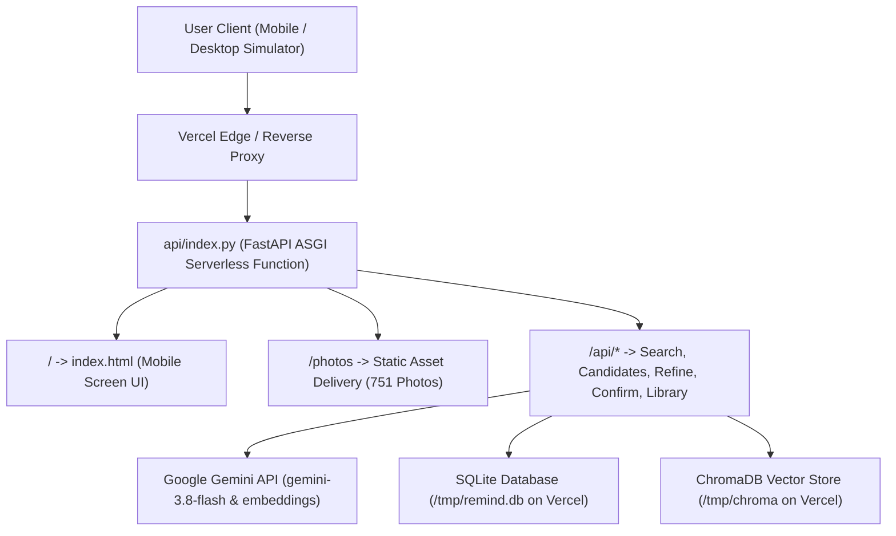

# 🚀 ReMind AI — Complete Deployment Plan

> **Project:** Google Photos — ReMind AI (Memory Reconstruction MVP)  
> **Target Environment:** Vercel (Serverless Prototype) & Alternative Production Hosts (Render / Railway / Docker)  
> **Status:** Ready for Deployment  
> **Date:** October 2026  

---

## 📋 Table of Contents
1. [Executive Summary & Architecture](#1-executive-summary--architecture)
2. [Mobile Screen Prototype Optimization](#2-mobile-screen-prototype-optimization)
3. [Vercel Deployment Architecture & Preparation](#3-vercel-deployment-architecture--preparation)
4. [Step-by-Step Vercel Deployment Guide](#4-step-by-step-vercel-deployment-guide)
5. [Environment Variables Reference](#5-environment-variables-reference)
6. [Alternative One-Click Deployments (Render / Railway / Docker)](#6-alternative-one-click-deployments)
7. [Post-Deployment Testing & Verification Checklist](#7-post-deployment-testing--verification-checklist)
8. [Troubleshooting & FAQs](#8-troubleshooting--faqs)

---

## 1. Executive Summary & Architecture

**ReMind AI** is a multimodal AI memory assistant for Google Photos. When users have vague recollections of forgotten moments, ReMind leverages Google Gemini models and semantic embeddings to iteratively reconstruct clues, narrow candidate photos through entropy-driven multi-turn refinement, and surface the recognized photo.

### System Architecture


---

## 2. Mobile Screen Prototype Optimization

The prototype has been optimized to render as an **authentic mobile experience**:

1. **Desktop Viewport Experience (Interactive Phone Simulator)**:
   - Features a **390 × 844 smartphone shell** (iPhone/Pixel ergonomic proportions) with sleek matte bezels, rounded `44px` corners, and realistic drop shadow elevation.
   - Includes a native **Smartphone Status Bar** (`9:41`, Dynamic Island camera pill, Wi-Fi, 5G signal, and battery indicator).
   - Bottom navigation and sticky conversational refinement bars are anchored within the smartphone frame.
   - Allows stakeholders, reviewers, and desktop testers to evaluate the prototype in authentic mobile proportions.

2. **Mobile Device Experience (Real Smartphones)**:
   - Automatically detects screens `< 640px` and expands to **100% full-screen immersive view** (`w-full min-h-screen`).
   - The desktop phone bezel and status bar disappear, giving mobile users a native web app feel with smooth touch ergonomics and gesture navigation.

---

## 3. Vercel Deployment Architecture & Preparation

Vercel is a global serverless platform. To make a Python + SQLite + ChromaDB application work on Vercel's serverless environment, the following architectural accommodations have been implemented:

### 3.1. File System Accommodation (`/tmp` Replication)
- **Vercel Constraint:** Vercel serverless function root directories (`/var/task`) are **read-only**. SQLite session writes and ChromaDB index writes will fail if attempted directly in `/var/task`.
- **Solution:** Our code auto-detects `VERCEL=1`. On serverless cold-start, the seeded `data/db/remind.db` (1 MB) and `data/chroma` (17.7 MB) are copied into `/tmp` (`/tmp/remind.db` and `/tmp/chroma`) in under 100ms.
- All session updates, constraints, and vector queries operate on `/tmp` with full read/write capabilities.

### 3.2. Serverless Function Size & Dependencies
- **Vercel Constraint:** Uncompressed function limit is 250 MB.
- **Solution:** Our project does **not** rely on heavyweight local PyTorch wheels. Embeddings are calculated via Google Gemini (`google-genai` / `google-generativeai`) and stored via `chromadb`.
- `requirements.txt` is kept lean: `fastapi`, `uvicorn`, `chromadb`, `sqlalchemy`, `pydantic`, `pillow`, `numpy`, `google-genai`.

### 3.3. Key Configuration Files Created
| File | Purpose | Location |
| :--- | :--- | :--- |
| `vercel.json` | Configures Vercel Python runtime (`@vercel/python`) and routes all paths to `api/index.py` | Project root |
| `api/index.py` | Vercel Serverless Function entry point exporting FastAPI `app` | `api/index.py` |
| `requirements.txt` | Python dependencies installed during Vercel build | Project root |
| `.vercelignore` | Excludes `.git`, `.venv`, `tests`, and logs to keep serverless bundle lightweight | Project root |

---

## 4. Step-by-Step Vercel Deployment Guide

### Option A: Deploy via GitHub (Recommended for Continuous Deployment)

1. **Commit & Push to GitHub**:
   Ensure all files are committed to your GitHub repository:
   ```bash
   git add .
   git commit -m "feat: mobile screen prototype and vercel deployment configuration"
   git push origin main
   ```

2. **Import Project into Vercel**:
   - Go to [vercel.com](https://vercel.com) and log in.
   - Click **"Add New..."** -> **"Project"**.
   - Select your GitHub repository (`Google-MVP` or similar).

3. **Configure Build Settings**:
   - **Framework Preset**: Select `Other`.
   - **Root Directory**: `./` (leave default).
   - **Build Command**: Leave empty (handled by `@vercel/python`).
   - **Output Directory**: Leave empty.

4. **Add Environment Variables**:
   In the **Environment Variables** section on Vercel, add:
   - `GEMINI_API_KEY`: `your_actual_gemini_api_key`
   - `EMBEDDING_PROVIDER`: `gemini` (or `local`)
   - `GEMINI_MODEL`: `gemini-3.8-flash`
   - `EMBEDDING_MODEL`: `gemini-embedding-001`
   - `PORT`: `8000`

5. **Click "Deploy"**:
   - Vercel will install dependencies from `requirements.txt`, bundle `api/index.py`, and launch your application at a URL like `https://google-photos-remind.vercel.app`.

---

### Option B: Deploy via Vercel CLI

1. **Install Vercel CLI** (if not installed):
   ```bash
   npm install -g vercel
   ```

2. **Login to Vercel**:
   ```bash
   vercel login
   ```

3. **Deploy from Project Root**:
   ```bash
   vercel
   ```
   Follow the prompts:
   - Set up and deploy? **Yes (`y`)**
   - Which scope? **Your personal account**
   - Link to existing project? **No (`n`)**
   - What's your project's name? **`google-photos-remind`**
   - In which directory is your code located? **`./`**

4. **Set Production Environment Variable**:
   ```bash
   vercel env add GEMINI_API_KEY
   ```
   Paste your Gemini API key when prompted, and select `Production, Preview, Development`.

5. **Deploy to Production**:
   ```bash
   vercel --prod
   ```

---

## 5. Environment Variables Reference

| Variable Name | Required | Default Value | Description |
| :--- | :---: | :--- | :--- |
| `GEMINI_API_KEY` | **Yes** | `""` | Google Gemini API Key from Google AI Studio |
| `GEMINI_MODEL` | No | `gemini-3.8-flash` | Gemini model for semantic understanding & questions |
| `EMBEDDING_MODEL` | No | `gemini-embedding-001` | Multimodal / text embedding model |
| `EMBEDDING_PROVIDER` | No | `local` | `local` uses vector store; `gemini` calls Gemini API |
| `MAX_CANDIDATES` | No | `20` | Maximum candidate photos retrieved per cluster |
| `MAX_REFINEMENT_TURNS` | No | `5` | Maximum refinement loop turns allowed |
| `PORT` | No | `8000` | Server listening port |

---

## 6. Alternative One-Click Deployments

If you prefer **persistent disk storage** without serverless `/tmp` limits (e.g., retaining search history indefinitely), the following hosting options are fully supported:

### 6.1. Render (Web Service)
1. Create a new **Web Service** on [render.com](https://render.com).
2. Connect your GitHub repository.
3. Configure:
   - **Environment:** `Python 3`
   - **Build Command:** `pip install -r backend/requirements.txt`
   - **Start Command:** `python -m uvicorn app.main:app --app-dir backend --host 0.0.0.0 --port $PORT`
4. Add `GEMINI_API_KEY` in Environment settings.

### 6.2. Railway
1. Go to [railway.app](https://railway.app) and click **"New Project" -> "Deploy from GitHub repo"**.
2. Railway detects Python automatically.
3. Set Custom Start Command:
   ```bash
   python -m uvicorn app.main:app --app-dir backend --host 0.0.0.0 --port $PORT
   ```
4. Add `GEMINI_API_KEY` variable.

### 6.3. Docker Container (Self-Hosted / Cloud Run / AWS ECS)
A production `Dockerfile` can be used:
```dockerfile
FROM python:3.12-slim

WORKDIR /app

RUN apt-get update && apt-get install -y --no-install-recommends \
    build-essential \
    && rm -rf /var/lib/apt/lists/*

COPY requirements.txt .
RUN pip install --no-cache-dir -r requirements.txt

COPY . .

EXPOSE 8000

CMD ["python", "-m", "uvicorn", "app.main:app", "--app-dir", "backend", "--host", "0.0.0.0", "--port", "8000"]
```

---

## 7. Post-Deployment Testing & Verification Checklist

Once deployed on Vercel, verify these test cases:

- [ ] **Health Endpoint (`/health`)**:
  - Visit `https://your-domain.vercel.app/health`.
  - Expect: `{"status": "ok", "service": "ReMind API", "version": "0.1.0", ...}`.
- [ ] **Mobile Screen Frame (`/`)**:
  - Open on desktop: Verify the smartphone frame renders centered at 390px width with status bar `9:41`.
  - Open on mobile phone: Verify full-bleed immersive screen with no horizontal scroll or letterboxing.
- [ ] **Photo Stream Loading**:
  - Verify all library photos load thumbnails and open full preview modals on click.
- [ ] **Search & Semantic Understanding**:
  - Enter: `"That grand palace courtyard we visited during our Rajasthan trip"`.
  - Verify semantic chips decomposition and confidence ratings.
- [ ] **Multi-Turn Refinement**:
  - Complete 3+ consecutive refinement turns.
  - Verify options do **not** run out or freeze (Turn 3, 4, 5 present dynamic objects and memory hints).
- [ ] **Photo Recognition & Rejection**:
  - Test clicking `"Yes"` on recognition -> Hero preview card confirmed.
  - Test clicking `"No"` on recognition -> Inline input `"What do you remember more?"` with smart hint keywords.

---

## 8. Troubleshooting & FAQs

### Q1: Vercel returns `404: NOT_FOUND` on API routes?
**Check:** Ensure `vercel.json` has `"routes": [{"src": "/(.*)", "dest": "api/index.py"}]`. This routes all requests through the FastAPI ASGI handler.

### Q2: Error `attempt to write a readonly database`?
**Fix:** Already handled! Our `backend/app/providers/database.py` detects `VERCEL=1` and routes SQLite writes to `/tmp/remind.db`.

### Q3: Photos thumbnails show broken images?
**Fix:** Photos are mounted in FastAPI under `/photos` from `data/photos/`. In Vercel, static files are preserved in the bundle. Ensure `.vercelignore` does **not** exclude `data/photos`.

### Q4: Gemini API requests fail with 403 or quota error?
**Fix:** Ensure `GEMINI_API_KEY` is configured in the Vercel Dashboard under **Project Settings -> Environment Variables**, and re-deploy.
