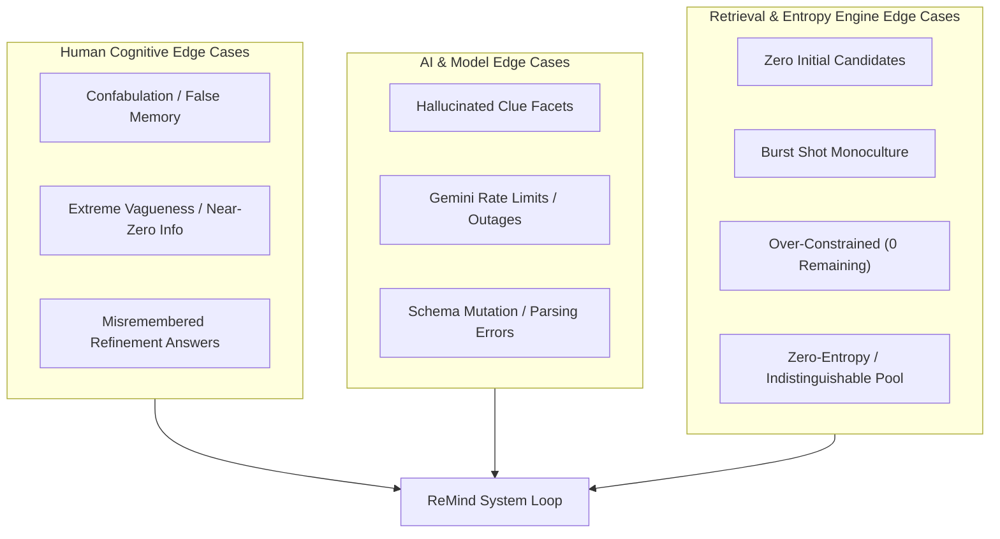

# ReMind — Edge Cases & Corner Scenarios

> **Comprehensive edge-case catalog, failure-mode analysis, and mitigation playbook** for the ReMind MVP.
> Grounded in [`context.md`](file:///c:/Users/Mukta Kulkarni/OneDrive/Desktop/Google MVP/context.md), [`architecture.md`](file:///c:/Users/Mukta Kulkarni/OneDrive/Desktop/Google MVP/architecture.md), and [`implementation-plan.md`](file:///c:/Users/Mukta Kulkarni/OneDrive/Desktop/Google MVP/implementation-plan.md).

---

## Table of Contents

1. [Edge-Case Taxonomy & Overview](#1-edge-case-taxonomy--overview)
2. [Category 1: Vague Memory & User Input Anomalies](#2-category-1-vague-memory--user-input-anomalies)
3. [Category 2: AI & Gemini Multimodal Model Corner Cases](#3-category-2-ai--gemini-multimodal-model-corner-cases)
4. [Category 3: Candidate Retrieval & Vector Search Edge Cases](#4-category-3-candidate-retrieval--vector-search-edge-cases)
5. [Category 4: Uncertainty Engine & Refinement Loop Pitfalls](#5-category-4-uncertainty-engine--refinement-loop-pitfalls)
6. [Category 5: Recognition, Confirmation & Human Feedback Corner Cases](#6-category-5-recognition-confirmation--human-feedback-corner-cases)
7. [Category 6: Dataset Curation & Offline Indexing Anomalies](#7-category-6-dataset-curation--offline-indexing-anomalies)
8. [Category 7: Client, Network & Session State Edge Cases](#8-category-7-client-network--session-state-edge-cases)
9. [Edge-Case Resolution Decision Matrix](#9-edge-case-resolution-decision-matrix)

---

## 1. Edge-Case Taxonomy & Overview

In a memory reconstruction system, failure modes do not only arise from software bugs; they fundamentally arise from **human cognitive limitations** (confabulation, vague memory, misattribution) coupled with **probabilistic AI reasoning** and **vector search boundaries**.



---

## 2. Category 1: Vague Memory & User Input Anomalies

### 1.1 Extremely Vague / Zero-Information Query
- **Scenario:** The user types queries with virtually zero retrieval signal, such as *"a photo"*, *"that picture"*, *"something from last year"*, or accidental whitespace/gibberish (`"asdf"`).
- **Failure Mode:** Vector search returns arbitrary nearest neighbors; memory parser hallucinates phantom locations or events with low confidence.
- **Detection:** Memory parser confidence scores across all facets are `< 0.2`, or text length `< 5` characters.
- **Mitigation & Fallback:**
  - Screen 1 validation blocks whitespace/empty submissions.
  - If input has no recognizable clue, Screen 2 prompts the user with memory-trigger guidance:
    > *"That memory is a bit too broad for me to start with. Try adding at least one detail — like a place, a person who was there, or what you were doing."*
  - Provide 4 clickable example chips (e.g., *"Goa trip cafe"*, *"College stage event"*, *"Outdoor dinner"*) to guide them.

---

### 1.2 User Confabulation / Factual Misattribution
- **Scenario:** The user remembers the photo being from *"our Goa trip"*, but the photo was actually taken during a trip to *"Gokarna"* or *"Pondicherry"*. Or they remember *"dinner with Rahul"*, but Rahul wasn't in that photo.
- **Failure Mode:** Strict metadata filtering (`location == "Goa"`) completely eliminates the target photo from candidates.
- **Detection:** Confidence mismatch or high vector distance when metadata filter is applied.
- **Mitigation & Fallback:**
  - **Soft Filtering Policy:** Never use hard SQL `WHERE` clauses on initial retrieval. Instead, combine vector similarity with metadata matching:
    $$\text{Score} = 0.6 \times \text{vector\_similarity} + 0.4 \times \text{metadata\_similarity}$$
  - The vector embedding still matches visual semantics (beach, cafe, sunset) even if the location tag differs.
  - On Screen 2 (Understanding), explicitly display editable clue chips: the user sees `[Goa • 90%]` and can tap to remove or change it before searching.

---

### 1.3 Contradictory Memory Descriptions
- **Scenario:** User enters mutually exclusive statements: *"An indoor beach cafe at midnight under the bright sun."*
- **Failure Mode:** LLM extracts contradictory tags (`scene: indoor`, `scene: outdoor`, `time: midnight`, `time: bright sun`), causing vector search confusion.
- **Detection:** Gemini memory parser flags logical conflict in its confidence breakdown (`confidence.time: 0.1`).
- **Mitigation & Fallback:**
  - The parser prioritizes the dominant physical setting and demotes conflicting adjectives.
  - Screen 2 highlights the ambiguity: *"I noticed you mentioned both 'midnight' and 'bright sun' — I focused on 'beach cafe'. You can refine this in the next step."*

---

### 1.4 Multilingual & Code-Mixed Queries (e.g., Hinglish)
- **Scenario:** The user inputs colloquial code-mixed queries: *"Woh Goa wala cafe jahan blue wall thi aur humne coffee pi thi."*
- **Failure Mode:** Conventional keyword search fails completely because terms like "wala" or "jahan" break token matchers.
- **Detection:** Language detection detects mixed-script or Latin-script non-English vocabulary.
- **Mitigation & Fallback:**
  - Google Gemini Multimodal Model natively understands Indic code-mixed languages and transliterated Hinglish.
  - The system prompt explicitly instructs Gemini: *"Parse multilingual and code-mixed inputs (e.g., Hinglish) into standard English retrieval facets."*
  - Clues are normalized to standard tags: `location: "Goa"`, `scene: "cafe"`, `visual_details: "blue wall, coffee"`.

---

### 1.5 Target Photo Simply Does Not Exist in Library
- **Scenario:** The user searches for a photo that was never taken, was deleted, or belongs to another library not in the 500–1,000 test set.
- **Failure Mode:** Endless refinement loops, user frustration, high abandonment, wasted API calls.
- **Detection:** Candidate scores after 3 refinement turns remain below confidence threshold (`similarity < 0.45`), or user repeatedly answers *"Not sure"*.
- **Mitigation & Fallback:**
  - Cap maximum refinement turns strictly at **5 turns**.
  - If turn 5 is reached without recognition, display the Clean Exit Screen:
    > *"We couldn't pinpoint this photo in your library. It might not be in this collection, or some details might differ. Would you like to start a new search or browse by date?"*
  - Log session as `unretrievable_target` for evaluation metrics without counting as an unhandled crash.

---

## 3. Category 2: AI & Gemini Multimodal Model Corner Cases

### 2.1 Gemini API Rate Limiting (HTTP 429) & Quota Exhaustion
- **Scenario:** Rapid multi-turn requests or concurrent test participants exceed Gemini API queries-per-minute (QPM).
- **Failure Mode:** API returns `429 Resource Exhausted`, halting user flow on Screen 2 or Screen 4.
- **Detection:** Caught by `google.genai.errors.ClientError` or HTTP status 429.
- **Mitigation & Fallback:**
  - **Exponential Backoff with Jitter:** Automatic 3-tier retry (`1s → 2s → 4s`).
  - **Graceful Algorithmic Fallback:**
    - For Screen 2 (Memory Parsing): Fall back to local regex/token clue extractor (`spacy` or keyword matcher).
    - For Screen 4 (Refinement Question): Bypass Gemini generation and use pre-templated string formatting based on entropy dimension:
      `f"Do you remember the {dimension.replace('_', ' ')}? Options: {', '.join(options)}"`
  - User sees zero disruption; the question is slightly less conversational but functionally identical.

---

### 2.2 Malformed / Non-JSON Output from LLM
- **Scenario:** Despite `response_mime_type="application/json"`, network interruption or edge-case completions cause truncated or non-parsable JSON.
- **Failure Mode:** `json.loads()` throws `JSONDecodeError`, causing an unhandled 500 error in FastAPI.
- **Detection:** `PydanticValidationError` or `JSONDecodeError` during response parsing.
- **Mitigation & Fallback:**
  - Implement a 2-stage sanitization pipeline in `providers/llm.py`:
    1. Direct Pydantic validation via `types.GenerateContentConfig(response_schema=...)`.
    2. Fallback regex extractor: `re.search(r'\{.*\}', response.text, re.DOTALL)`.
    3. If both fail, return a default fallback schema rather than raising an unhandled exception.

---

### 2.3 Hallucinated Clue Extraction
- **Scenario:** User says *"that rainy afternoon in Bangalore"*, and Gemini invents: `people: ["Rahul", "Priya"]` because of common training patterns.
- **Failure Mode:** Erroneous people filter injected into retrieval query, eliminating solo photos.
- **Detection:** Any clue in the structured output that has zero character overlap with the user's prompt must be flagged.
- **Mitigation & Fallback:**
  - Prompt constraint: *"Only extract entities explicitly mentioned or strictly implied. If an entity is not mentioned, it MUST be null. Never invent people, objects, or dates."*
  - Strict grounding filter: If `clue.people` contains names not present in `user_input.lower()`, the backend drops the field before retrieval.

---

### 2.4 Safety Filter / Content Moderation Triggers
- **Scenario:** A user searches for medical document photos (e.g., *"prescription for rash"*) or images contain sensitive health data, triggering Gemini safety filters.
- **Failure Mode:** Gemini returns `finish_reason: SAFETY`, returning an empty completion.
- **Detection:** Response inspects `candidate.finish_reason == FinishReason.SAFETY`.
- **Mitigation & Fallback:**
  - Configure Gemini client safety settings: set `HarmCategory.HARM_CATEGORY_DANGEROUS_CONTENT` and others to `BLOCK_ONLY_HIGH` for testing medical document datasets.
  - If a query triggers safety rejection, fall back to pure embedding similarity search without LLM parsing, displaying a gentle notice.

---

## 4. Category 3: Candidate Retrieval & Vector Search Edge Cases

### 3.1 Zero Initial Candidates Retrieved
- **Scenario:** Vector store similarity threshold is set too high (e.g. cosine distance `> 0.8`), or obscure keywords yield no matches.
- **Failure Mode:** Screen 3 displays an empty photo grid (`0 possibilities`), dead-ending the user.
- **Detection:** `len(candidates) == 0` returned from `RetrievalService`.
- **Mitigation & Fallback:**
  - **Dynamic Relaxed Thresholding:** If initial query yields 0 results, automatically:
    1. Drop all metadata filters.
    2. Lower the vector similarity threshold by 0.15.
    3. Re-query ChromaDB to retrieve the nearest top-20 semantic neighbors.
  - Display helpful context banner: *"We couldn't find an exact match, but here are the closest photos from your library."*

---

### 3.2 Burst Shot / Duplicate Photo Monoculture
- **Scenario:** User took 15 burst photos within 5 seconds at the same table in a cafe. All 15 flood the top 20 candidate list, hiding other possible cafes.
- **Failure Mode:** Candidate list lacks diversity; user is presented with 15 nearly identical photos, preventing effective refinement.
- **Detection:** Multiple candidates share identical `date_taken` (within 60 seconds) and high cosine similarity (`> 0.95` between each other).
- **Mitigation & Fallback:**
  - **Maximal Marginal Relevance (MMR) Diversification:**
    - Apply MMR de-duplication: select candidates that are relevant to the query while penalizing similarity to already-selected candidates:
      $$\text{MMR}(d_i) = \lambda \cdot \text{Sim}(d_i, q) - (1 - \lambda) \cdot \max_{d_j \in S} \text{Sim}(d_i, d_j)$$
    - Cluster burst shots together; only display the best representative photo from a 2-minute time window in the initial candidate set.

---

### 3.3 Candidate Score Ties (Identical Distances)
- **Scenario:** Multiple photos have identical embedding scores (e.g., 5 identical stock beach photos).
- **Failure Mode:** Non-deterministic sorting order causing UI jitter and inconsistent test runs.
- **Detection:** Multiple candidates have equal float scores up to 4 decimal places.
- **Mitigation & Fallback:**
  - Implement a deterministic secondary sort key: `sort_key = (score, date_taken, photo_id)`.
  - Ensures identical queries always return identical order across test sessions.

---

## 5. Category 4: Uncertainty Engine & Refinement Loop Pitfalls

### 4.1 Over-Constrained Filtering (Candidates Drop to 0)
- **Scenario:** User has 6 candidate cafes on Turn 1. On Turn 2, system asks *"Was it near the beach?"*. User taps *"Near the beach"*, but none of the 6 cafes were near the beach (or metadata tagged them as "city"). Candidates drop from 6 to 0.
- **Failure Mode:** Empty screen; user cannot proceed and the search is ruined.
- **Detection:** Candidate count after applying constraint becomes 0 (`len(filtered_candidates) == 0`).
- **Mitigation & Fallback:**
  - **Automatic Rollback with Soft Relaxation:**
    - Detect the zero-candidate condition immediately in `services/ranking.py`.
    - Do not apply hard pruning. Instead, keep the previous 6 candidates, down-rank the non-matching ones, and display a gentle notification:
      > *"None of those 6 photos were near the beach. Showing the closest ones from that trip — let's try another clue!"*
    - The engine automatically picks the next-best entropy dimension (e.g., `time_of_day`) for the next question.

---

### 4.2 Zero-Entropy / Indistinguishable Candidate Pool
- **Scenario:** All remaining 10 candidate photos share identical values across all dimensions (e.g., all 10 are *daytime*, *outdoor*, *beach*, *with friends*).
- **Failure Mode:** Shannon entropy for all dimensions equals 0; the engine cannot formulate a meaningful discriminating question.
- **Detection:** $\max(H(d)) == 0.0$ across all available dimensions.
- **Mitigation & Fallback:**
  - When entropy across all standard dimensions is 0, do not generate a meaningless question.
  - Immediately auto-transition from Screen 4 to Screen 5 (Success / Direct Review):
    > *"We've narrowed it down to these {N} photos that match everything you remember. Take a look below — is one of these the photo?"*
  - Display the remaining photos in an enlarged horizontal carousel.

---

### 4.3 Repeated "I Don't Remember" / "Not Sure" Responses
- **Scenario:** The user answers *"Not sure"* for 3 consecutive turns.
- **Failure Mode:** The candidate set never reduces in size; system wastes turns asking questions the user cannot answer.
- **Detection:** `session.constraints` contains 2 or more consecutive `"not_sure"` entries.
- **Mitigation & Fallback:**
  - Blacklist the unhelpful dimension for the remainder of the session.
  - Pivot from conceptual dimensions (e.g., `setting`, `time`) to tangible visual anchors:
    - *"Do you recall any specific objects in the photo? (e.g., food/drinks, vehicles, signs, pets)"*
  - If 3 *"Not sure"* responses occur, provide a direct shortcut: `[Show all remaining photos in full size]` to allow visual scanning.

---

### 4.4 User Misremembers a Refinement Answer (Input Error)
- **Scenario:** The photo was taken at 6:30 PM (sunset/dusk), but the user selects *"During the day"*.
- **Failure Mode:** Target photo is erroneously filtered out.
- **Detection:** User reaches end of loop and clicks *"No, keep looking"*.
- **Mitigation & Fallback:**
  - When user clicks *"No, keep looking"* on Screen 5, the app provides a Reset / Backtrack chip:
    > *"Undo last clue: 'During the day'?"*
  - Fuzzy boundary tolerance: images taken near boundary hours (e.g., 5:00 PM – 6:30 PM) are tagged as both `day` and `evening` in metadata to prevent accidental pruning.

---

### 4.5 Cyclic / Repetitive Question Generation
- **Scenario:** The LLM re-asks a question already answered in Turn 1 (e.g. asking about location when Goa was already established).
- **Failure Mode:** Frustrating user experience; breaks the illusion of intelligent progressive reconstruction.
- **Detection:** Checking `dimension in session.answered_dimensions`.
- **Mitigation & Fallback:**
  - Explicitly maintain a session history of evaluated dimensions: `answered_dimensions: set[str]`.
  - Exclude all previously asked dimensions from the entropy calculation candidate list:
    `remaining_dimensions = [d for d in all_dimensions if d not in answered_dimensions]`.

---

## 6. Category 5: Recognition, Confirmation & Human Feedback Corner Cases

### 5.1 False Positive Recognition (Accidental Confirmation)
- **Scenario:** User hurriedly clicks *"Yes, that's it!"* on Screen 5, but realizes 2 seconds later that it was the wrong photo.
- **Failure Mode:** Evaluation logs record a false positive retrieval; user is stranded on the finish screen.
- **Detection:** User attempts to click back or navigate within 5 seconds of confirmation.
- **Mitigation & Fallback:**
  - Provide an *"Undo / Keep Searching"* toast banner on the confirmation screen for 8 seconds.
  - Tapping *"Undo"* re-opens the session with the candidate set intact, logging the correction as an event for test metrics.

---

### 5.2 False Negative Rejection ("No, Keep Looking" on Target Photo)
- **Scenario:** The target photo is displayed on Screen 5, but because the thumbnail is small or the user expected a different angle, they tap *"No, keep looking"*.
- **Failure Mode:** The correct photo is permanently discarded from consideration.
- **Mitigation & Fallback:**
  - Tapping *"No, keep looking"* down-weights that specific photo by 50% rather than deleting it completely from the session candidate pool.
  - If no other candidates match future refinements, the system can resurrect the rejected photo with a notice: *"Could this have been it after all?"*

---

### 5.3 Mid-Session Abandonment
- **Scenario:** User closes the browser tab, locks their phone, or walks away during Screen 3 or Screen 4.
- **Failure Mode:** Session remains perpetually in `active` state; metrics cannot distinguish between slow retrieval and abandonment.
- **Detection:** Client heartbeat timeout: no event received for `session_id` within 5 minutes.
- **Mitigation & Fallback:**
  - Background daemon cron runs every 10 minutes: marks stale active sessions (`last_updated > 5 min`) as `status = 'abandoned'`.
  - Logs `abandonment_turn = turn_count` and `abandonment_screen` to accurately report abandonment rate metrics in evaluation reports.

---

## 7. Category 6: Dataset Curation & Offline Indexing Anomalies

### 6.1 Corrupted, Truncated or Unsupported Image Files
- **Scenario:** A test photo is corrupted, zero bytes, or in unsupported format (`.heic`, `.raw`, `.tiff`).
- **Failure Mode:** Indexing script crashes midway through processing a 1,000-photo batch.
- **Detection:** `PIL.UnidentifiedImageError` during image loading in `scripts/index_photos.py`.
- **Mitigation & Fallback:**
  - Wrap image ingestion in a `try...except` block in `ImageLoader`:
    ```python
    try:
        with Image.open(path) as img:
            img.verify()
    except Exception as e:
        logger.warning(f"Skipping invalid image {path}: {e}")
        continue
    ```
  - Convert all valid images to standard RGB JPEG (`.jpg`) format during dataset preparation.

---

### 6.2 Low-Quality / Blurry / Extreme Lighting Images
- **Scenario:** Photos taken in pitch dark (e.g. night club) or severely blurred motion shots where objects cannot be distinguished.
- **Failure Mode:** Gemini vision API produces empty or meaningless descriptions (`"dark image with unknown shapes"`).
- **Detection:** Gemini output returns empty `objects` array and `visual_description` length `< 20` characters.
- **Mitigation & Fallback:**
  - Enrich metadata with EXIF parameters if available (e.g., date, time, camera model).
  - Assign fallback tags: `scene: ["night", "abstract", "dark"]`.
  - Ensure combined representation still receives a vector embedding so the photo remains retrievable by temporal or cluster context.

---

### 6.3 Missing or Corrupted EXIF Timestamps
- **Scenario:** Photos downloaded from messaging apps (WhatsApp, Telegram) have EXIF metadata stripped; timestamps show `1970-01-01` or current download date.
- **Failure Mode:** Temporal sorting and date-based constraints fail completely.
- **Detection:** `date_taken` is `None` or matches Unix epoch `1970-01-01`.
- **Mitigation & Fallback:**
  - Fall back to folder-level metadata: parse folder names (e.g. `goa_trip_dec_2025/`) to infer default date ranges.
  - Rely on visual lighting extracted by Gemini (`time_of_day: "day" | "evening" | "night"`) instead of relying solely on EXIF clock time.

---

## 8. Category 7: Client, Network & Session State Edge Cases

### 7.1 Browser / OS Back-Button Navigation
- **Scenario:** User is on Screen 4 (Refinement) and taps the physical Android back button or browser back arrow.
- **Failure Mode:** Navigation stack desynchronizes; frontend shows Screen 3 with stale or undefined state.
- **Detection:** Navigation event triggers without state update.
- **Mitigation & Fallback:**
  - In React Native / Expo: implement `BackHandler` interceptor.
  - Navigating back to Screen 3 properly restores the previous candidate list for that turn without corrupting server session state.

---

### 7.2 Intermittent Network Disconnection Mid-Search
- **Scenario:** User enters a tunnel or loses Wi-Fi while submitting an answer on Screen 4.
- **Failure Mode:** Request drops; UI displays infinite loading spinner.
- **Detection:** Axios request timeout after 8,000 ms.
- **Mitigation & Fallback:**
  - Implement Axios timeout and retry interceptor.
  - Display non-blocking retry banner:
    > *"Connection lost. Check your internet and [Tap to Retry]."*
  - Session state is persisted in SQLite on the backend; resuming the request retains the exact session state.

---

### 7.3 Memory Overhead on Mobile Viewport
- **Scenario:** Displaying 20 full-resolution (4K) photos simultaneously on Screen 3 crashes mobile web or causes extreme stutter.
- **Failure Mode:** Mobile browser crashes with Out-Of-Memory (OOM) error.
- **Detection:** High DOM memory footprint or scroll lag.
- **Mitigation & Fallback:**
  - Create downscaled 250px square thumbnail images during Phase 1 indexing stored in `data/photos/thumbnails/`.
  - Screen 3 strictly requests thumbnails (`/photos/thumbnails/{id}.jpg`).
  - Full-resolution photo is only requested on Screen 5 (Success Screen) for single-image inspection.

---

## 9. Edge-Case Resolution Decision Matrix

| # | Edge Case Scenario | Trigger Level | Primary Mitigation Technique | Fallback / User Experience |
|---|-------------------|---------------|------------------------------|----------------------------|
| **1** | Blank / meaningless input (`"asdf"`) | Screen 1 | Prompt length & confidence validation | Guidance prompt with 4 example chips |
| **2** | False memory / Confabulation | Screen 2 | Soft metadata scoring + Vector similarity | Clue chips editable on Screen 2 |
| **3** | Multilingual / Hinglish input | Screen 2 | Gemini Multimodal natural language translation | Normalized English retrieval facets |
| **4** | Target photo not in dataset | Loop | Turn cap (max 5 turns) | Clean exit screen offering restart |
| **5** | Gemini API rate limit (429) | Backend | Exponential backoff retry | Pre-templated question fallback |
| **6** | Malformed JSON from LLM | Backend | 2-stage Pydantic + Regex sanitizer | Default schema fallback |
| **7** | Zero initial candidates | Screen 3 | Relaxed threshold & drop metadata filters | Display nearest semantic neighbors banner |
| **8** | Burst shot monoculture | Screen 3 | Maximal Marginal Relevance (MMR) | Show 1 representative photo per burst |
| **9** | Over-constrained (0 candidates) | Screen 4 | Immediate filter rollback | *"Let's try another clue"* + Next best dimension |
| **10**| Zero-entropy candidate pool | Screen 4 | Shannon entropy threshold check | Auto-transition to Screen 5 direct review |
| **11**| Repeated *"Not sure"* answers | Screen 4 | Blacklist dimension & switch to visual anchors | Shortcut button: *"Browse all remaining"* |
| **12**| Misremembered refinement answer | Screen 5 | Rejection down-weighting (50%) | *"Undo last clue"* action chip |
| **13**| False positive recognition | Screen 5 | 8-second undo toast window | Restore candidate set seamlessly |
| **14**| Mid-session abandonment | Backend | 5-minute inactivity timeout daemon | Session marked `abandoned` for metrics |
| **15**| Corrupted image file | Pipeline | Image verification check in `index_photos.py` | Gracefully skip file & log warning |
| **16**| High mobile memory usage | Client | 250px thumbnail generation | Full-res photo loaded only on Screen 5 |
