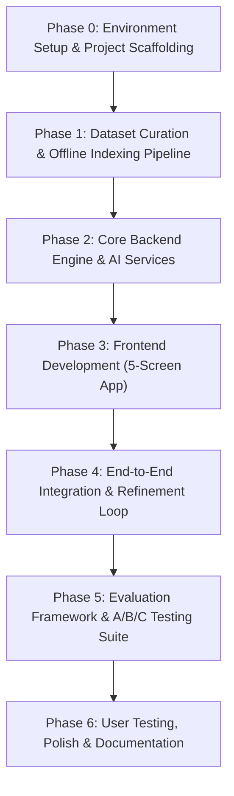
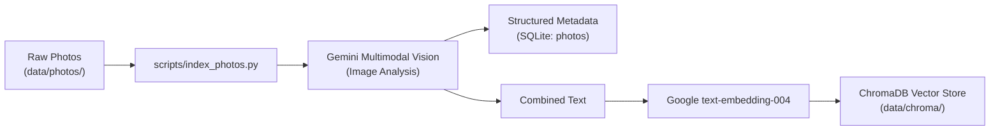
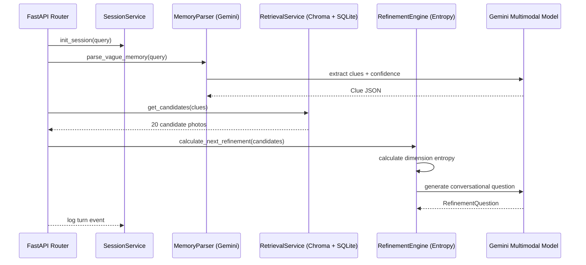
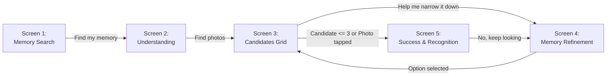
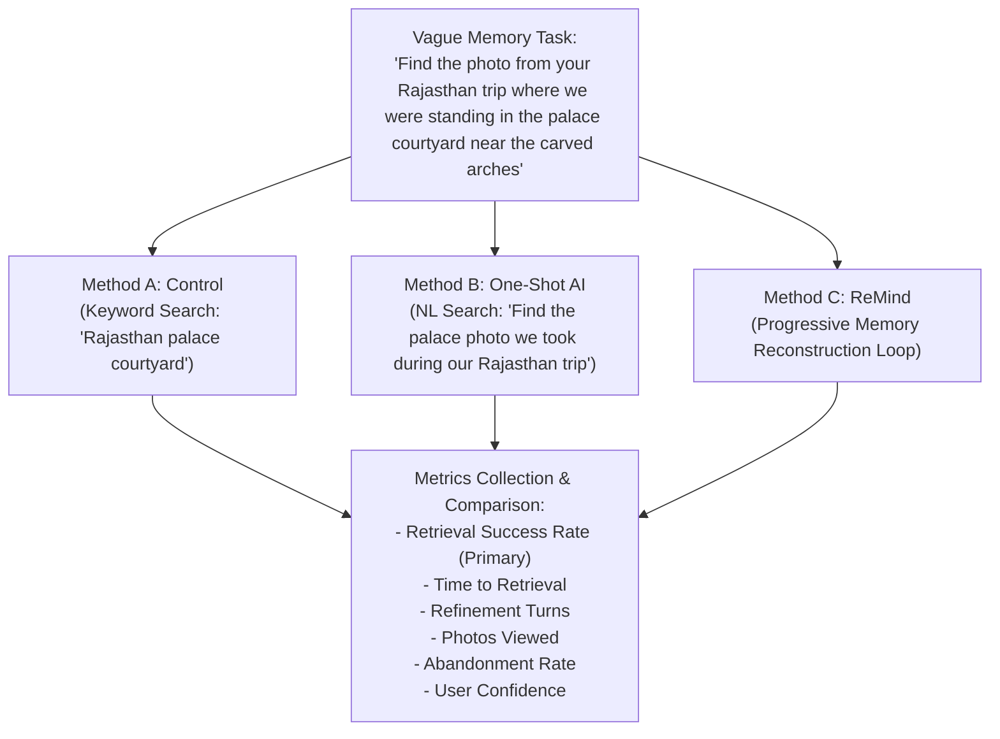

# ReMind — Phase-Wise Implementation Plan

> **Step-by-step technical implementation roadmap** for building the Google Photos Memory Reconstruction MVP.
> Grounded in [`context.md`](file:///c:/Users/Mukta Kulkarni/OneDrive/Desktop/Google MVP/context.md) and [`architecture.md`](file:///c:/Users/Mukta Kulkarni/OneDrive/Desktop/Google MVP/architecture.md).

---

## Roadmap Overview



### Phase Schedule & Milestones

| Phase | Focus Area | Deliverables | Key Dependencies |
|-------|------------|--------------|------------------|
| **Phase 0** | Setup & Scaffolding | Repo tree, virtualenvs, `.env`, Docker, basic healthcheck | Node.js 20+, Python 3.11+ |
| **Phase 1** | Dataset & Indexing | 500–1K photo dataset, SQLite schema, Gemini vision indexing, ChromaDB embeddings | Gemini API Key, image library |
| **Phase 2** | Backend & AI Engine | Gemini provider, memory parser, retrieval, uncertainty entropy engine, FastAPI endpoints | Phase 1 vector index |
| **Phase 3** | Frontend Mobile App | 5 interactive screens (Search, Understanding, Candidates, Refinement, Success) | Expo / React Native |
| **Phase 4** | E2E Integration | Full end-to-end loop, session lifecycle, image serving, edge-case recovery | Phase 2 API, Phase 3 UI |
| **Phase 5** | Evaluation & A/B/C Test | Benchmark runner script, Baselines A & B, automated metric reporting | Phase 4 stable app |
| **Phase 6** | Testing & Polish | User test trial (10–20 participants), UI polish, comprehensive docs | Phase 5 test harness |

---

## Phase 0: Environment Setup & Project Scaffolding

### Objective
Establish the project workspace, version control structure, dependency environments, configuration management, and initial build pipelines.

### Tasks

- [ ] **Task 0.1: Repository & Workspace Organization**
  - Create standard folder structure (`backend/`, `frontend/`, `scripts/`, `data/`, `tests/`).
  - Configure `.gitignore` for Python (`__pycache__`, `.venv`), Node (`node_modules`, `.expo`), and local data (`data/chroma`, `data/photos`, `*.db`).
  - Initialize Git repository.

- [ ] **Task 0.2: Backend Environment & Dependencies**
  - Create Python 3.11+ virtual environment (`python -m venv .venv`).
  - Create `backend/requirements.txt` with core libraries:
    - `fastapi>=0.110.0`, `uvicorn[standard]>=0.28.0`
    - `google-genai>=0.1.1` (or `google-generativeai>=0.8.0`)
    - `chromadb>=0.5.0`
    - `sqlalchemy>=2.0.0`
    - `pydantic>=2.6.0`, `pydantic-settings>=2.2.0`
    - `pillow>=10.2.0`, `numpy>=1.26.0`
    - `python-dotenv>=1.0.0`, `pytest>=8.0.0`, `httpx>=0.27.0`
  - Build `backend/app/config.py` using `pydantic_settings.BaseSettings` for `.env` loading.
  - Implement a basic `/health` check route in `backend/app/main.py`.

- [ ] **Task 0.3: Frontend Mobile App Scaffolding**
  - Initialize React Native Expo application in `frontend/` (`npx create-expo-app --template blank-typescript`).
  - Configure Expo for mobile (iOS/Android via Expo Go) and web preview support (`npx expo install react-dom react-native-web`).
  - Install navigation & UI primitives:
    - `@react-navigation/native`, `@react-navigation/stack` (or Expo Router)
    - `lucide-react-native`, `react-native-safe-area-context`
    - `axios` for HTTP communication

- [ ] **Task 0.4: Configuration & Docker Baseline**
  - Create `.env.example` defining:
    - `GEMINI_API_KEY`
    - `GEMINI_MODEL=gemini-1.5-flash`
    - `EMBEDDING_MODEL=text-embedding-004`
    - `CHROMA_PERSIST_DIR=./data/chroma`
    - `SQLITE_DB_PATH=./data/db/remind.db`
    - `PHOTO_DIR=./data/photos`
    - `MAX_CANDIDATES=20`
    - `MAX_REFINEMENT_TURNS=5`
  - Create `docker-compose.yml` for unified local container execution.

### Phase 0 Acceptance Criteria
- [x] Backend runs locally at `http://localhost:8000/health` returning `{"status": "ok"}`.
- [x] Expo app starts cleanly and displays a welcome screen on web or mobile simulator.
- [x] All `.env` variables load reliably into `config.py` with validation.

---

## Phase 1: Dataset Curation & Offline Indexing Pipeline

### Objective
Assemble a realistic test library of 500–1,000 photos organized into memory clusters with distractors, extract rich multimodal metadata using the Google Gemini Multimodal Model, generate vector embeddings, and build the persistent ChromaDB index.



### Tasks

- [x] **Task 1.1: Dataset Curation & Directory Organization**
  - Collect or synthesize 500–1,000 images structured into distinct memory clusters in `data/photos/`:
    - `rajasthan_trip/` (~160 photos: grand palace courtyards, forts, desert dunes, camel ride, heritage hotel, cultural dinner), including dedicated **palace** sub-series (royal courtyards, marble corridors, ornate arches, palace illuminated at dusk).
    - `coorg_friends_trip/` (~120 photos: coffee estate walks, homestay veranda, misty viewpoints, waterfalls, campfire evenings with friends).
    - `kids_playing_water/` (~90 photos: kids playing in pool and water with friends, splash pads, river stream, garden sprinkler games).
    - `bangalore_weekend/` (~100 photos: brewery, park, cafe, mall, indoor games).
    - `college_event/` (~80 photos: auditorium, stage, award ceremony, group pictures, canteen).
    - `medical_docs/` (~70 photos: prescriptions, lab reports, medicine bottles, clinic receipts).
    - `distractors/` (~120 photos: random urban scenes, food plates, pets, landscape wallpapers).
  - Ensure image filenames are normalized and unique (e.g., `raj_palace_001.jpg`, `coorg_015.jpg`, `water_kids_008.jpg`, `blr_042.jpg`).

- [x] **Task 1.2: Metadata Database Schema (SQLite)**
  - Implement SQLAlchemy models in `backend/app/providers/database.py`:
    - Table `photos`: `photo_id`, `file_path`, `date_taken`, `location`, `people` (JSON), `event`, `scene` (JSON), `objects` (JSON), `visual_description`, `ocr_text`, `setting`, `time_of_day`.
    - Table `sessions`: `session_id`, `original_query`, `clues` (JSON), `constraints` (JSON), `candidate_ids` (JSON), `turn_count`, `status`.
    - Table `session_events`: `id`, `session_id`, `event_type`, `payload` (JSON), `created_at`.
  - Write database initialization migration script (`scripts/init_db.py`).

- [x] **Task 1.3: Multimodal Vision Analysis via Gemini**
  - Implement offline indexing script `scripts/index_photos.py`.
  - For each image, send raw image bytes to **Google Gemini Multimodal Model** (`gemini-1.5-flash`) with structured schema prompt:
    - Extract: `visual_description`, `scene`, `objects`, `people_count`, `setting` (indoor/outdoor), `time_of_day` (day/evening/night), and `ocr_text`.
    - Enforce Gemini JSON output (`response_mime_type="application/json"`).
  - Implement batch processing (batches of 10), retry on rate limit (HTTP 429), and idempotency check (skip already indexed `photo_id`).

- [x] **Task 1.4: Embedding Generation & ChromaDB Ingestion**
  - Construct the unified composite text representation for each photo:
    ```
    "{visual_description}. Setting: {scene}. Objects: {objects}. People count: {people_count}. Location: {location}. Event: {event}. Text in photo: {ocr_text}."
    ```
  - Generate embeddings using Google `text-embedding-004` (fallback: `all-MiniLM-L6-v2`).
  - Store embeddings and metadata into ChromaDB collection `photo_embeddings` under `data/chroma/`.

- [x] **Task 1.5: Pipeline Verification & Sanity Check**
  - Implement `scripts/verify_index.py`:
    - Confirm total photos indexed in SQLite matches ChromaDB vector count.
    - Run 3 sample semantic queries (e.g., "coffee table near blue wall") and verify top-5 retrieved photos.

### Phase 1 Acceptance Criteria
- [x] At least 500 photos indexed with valid metadata records in SQLite.
- [x] ChromaDB collection populated with corresponding vector embeddings.
- [x] Semantic similarity query returns relevant photos in < 500 ms.

---

## Phase 2: Core Backend Engine & AI Services

### Objective
Build the FastAPI service layer powering the 5-step memory reconstruction loop: Gemini memory parsing, candidate retrieval, uncertainty-driven refinement question generation, re-ranking, and session tracking.



### Tasks

- [x] **Task 2.1: Gemini AI Provider Layer (`providers/llm.py`)**
  - Instantiate `genai.Client(api_key=settings.GEMINI_API_KEY)`.
  - Implement asynchronous methods:
    - `parse_memory(text: str) -> Clue`: extracts structured retrieval facets (`location`, `event`, `scene`, `people`, `time`, `visual_details`) with confidence scores (0.0–1.0).
    - `generate_refinement_prompt(dimension: str, candidate_summary: dict) -> RefinementQuestion`: creates natural, conversational clarifying questions with 2–4 options + "Not sure".
  - Configure exponential backoff retry handler (3 retries) for resilience.

- [x] **Task 2.2: Memory Understanding Service (`services/memory_parser.py`)**
  - Validate and normalize extracted clue facets.
  - Filter out zero-confidence hallucinations.
  - Return formatted clue chips with confidence indicators for frontend Screen 2.

- [x] **Task 2.3: Hybrid Candidate Retrieval Service (`services/retrieval.py`)**
  - Synthesize search query string from confident clues (confidence ≥ 0.5).
  - Query ChromaDB collection with query embedding for top-K candidates (default: 20).
  - Apply metadata constraints (e.g., location or event matching if confidence is high).
  - Join vector results with SQLite `photos` table to retrieve full photo records, thumbnails, and metadata.

- [x] **Task 2.4: Uncertainty-Driven Refinement Engine (`services/refinement.py`)**
  - Implement the core mathematical innovation:
    - Evaluate candidate distribution across discrete dimensions: `time_of_day`, `setting`, `people_count`, `activity`, `scene`.
    - Compute Shannon entropy for each dimension:
      $$H(d) = -\sum_{i=1}^{k} \frac{n_i}{N} \log_2 \frac{n_i}{N}$$
    - Select the dimension with maximal entropy (the question that splits candidates most evenly).
    - Invoke Gemini provider to craft the user-facing question and selectable options.

- [x] **Task 2.5: Re-Ranking & Constraint Filter (`services/ranking.py`)**
  - When user selects an option in Screen 4:
    - If user selects a specific option (e.g. "Evening"): apply hard/soft metadata filter to prune conflicting candidates (e.g., 20 candidates → 6 candidates).
    - If user selects "Not sure" / "I don't remember": do not eliminate photos; re-rank by second-best dimension or maintain current ranking.
  - Combine semantic score with metadata match ratio:
    $$\text{Score} = 0.6 \times \text{vector\_similarity} + 0.4 \times \text{metadata\_match}$$

- [x] **Task 2.6: Session & Metric Logger (`services/session.py`)**
  - Generate UUID `session_id` upon search initiation.
  - Track session state: `original_query`, `clues`, `accumulated_constraints`, `current_candidates`, `turn_count`.
  - Log fine-grained events into `session_events`: timestamps, photos viewed, options chosen, completion or abandonment.

- [x] **Task 2.7: REST API Endpoints Implementation**
  - Implement endpoints according to the API contract in [`architecture.md`](file:///c:/Users/Mukta Kulkarni/OneDrive/Desktop/Google MVP/architecture.md#7-api-contract):
    - `POST /api/search`: create session.
    - `POST /api/understand`: parse vague memory.
    - `POST /api/candidates`: retrieve candidate photos.
    - `POST /api/refine`: generate uncertainty refinement question.
    - `POST /api/confirm`: record final recognition or "keep looking" rejection.
    - `GET /photos/{photo_id}`: serve photo files/thumbnails.

### Phase 2 Acceptance Criteria
- [x] All 5 API endpoints return HTTP 200 with valid JSON contracts.
- [x] Given a vague query, candidate retrieval yields 20 relevant photos in < 1s.
- [x] Refinement engine computes entropy across candidate subsets and produces coherent questions via Gemini in < 2s.
- [x] Session events persist accurately in SQLite.

---

## Phase 3: Frontend Development (5-Screen Mobile App)

### Objective
Build the lightweight, responsive 5-screen application delivering the ReMind user experience on mobile and web, highlighting progressive memory reconstruction.



### Tasks

- [x] **Task 3.1: Global State & API Service Integration**
  - Interactive Single-Page Application (`backend/app/static/index.html`) faithfully implementing Stitch UI designs.
  - State machine: `sessionId`, `currentTurn`, `candidates`, `selectedHeroPhoto`, `loading`, `error`.
  - Full API integration wrapping `fetch` with endpoints `/api/search`, `/api/understand`, `/api/candidates`, `/api/refine`, `/api/confirm`.

- [x] **Task 3.2: Screen 1 — Memory Search (`Screen 1: Memory Search`)**
  - Large prompt text: *"What do you remember?"*
  - Multi-line natural language text input with placeholder: *"e.g., That grand palace courtyard we visited during our Rajasthan trip..."*
  - Quick-start suggestion chips for testing: *"Rajasthan palace at dusk"*, *"Friends trip in Coorg"*, *"Kids playing in water"*, *"College stage event"*.
  - Primary CTA button: *"Find my memory"*.

- [x] **Task 3.3: Screen 2 — Understanding (`Screen 2: Understanding`)**
  - Header: *"Here's what I understood"*.
  - Render parsed clue facets as interactive chips with confidence score badges (e.g., *"Rajasthan • 95%"*, *"Palace Courtyard • 90%"*, *"Evening / Dusk • 85%"*).
  - Ability for user to add new memory clues or remove false clues.
  - Primary CTA button: *"Find photos"*.

- [x] **Task 3.4: Screen 3 — Candidates Grid (`Screen 3: Candidates Grid`)**
  - Header: *"I found {N} possibilities"* (initially 20 photos; updates dynamically to e.g. 6 after refinement).
  - Responsive 2-column photo grid showing photo thumbnails, location badges, and match confidence scores.
  - Tapping an individual photo selects it as hero candidate and navigates to Screen 5 for confirmation.
  - Prominent sticky CTA bar: *"Help me narrow it down"* (transitions to Screen 4).

- [x] **Task 3.5: Screen 4 — Memory Refinement (`Screen 4: Memory Refinement`)**
  - Header: *"What else do you remember?"*
  - Display the dynamically generated Gemini uncertainty question (e.g., *"Do you remember if it was during the day or evening?"*).
  - Large, touch-friendly option buttons for each alternative (e.g., `[During the day]`, `[In the evening]`, etc.).
  - Subtle secondary option: `[I don't remember / Not sure]`.
  - Selecting an option triggers backend re-ranking and routes back to updated Candidates Screen with transition banner: *"These {N} look closer."*

- [x] **Task 3.6: Screen 5 — Success & Recognition (`Screen 5: Success & Recognition`)**
  - Header: *"I think we found it!"*
  - Prominent full-screen display of the candidate photo with date, location, and visual description caption.
  - Question: *"Is this the photo you remember?"*
  - Two clear action buttons:
    - Primary: `[Yes, that's it!]` (celebration modal with session metrics, photos viewed, turns count).
    - Secondary: `[No, keep looking]` (returns to refinement loop for further narrowing).

- [x] **Task 3.7: Static Asset Delivery & Loading States**
  - Configured FastAPI to mount `/photos` directory and `/static` assets.
  - Root route `GET /` directly serves high-fidelity responsive application.
  - Shimmer loading spinners and transition states between retrieval and refinement turns.

### Phase 3 Acceptance Criteria
- [x] All 5 screens render smoothly with high readability and zero UI clipping on mobile viewport.
- [x] State transitions between screens reflect backend data changes without stale states.
- [x] Images and thumbnails load promptly with appropriate loading skeletons.

---

## Phase 4: End-to-End Integration & Refinement Loop

### Objective
Wire the frontend application to the FastAPI backend, validate the complete multi-turn progressive refinement loop, and implement robust error recovery.

### Tasks

- [x] **Task 4.1: End-to-End Wiring & Network Configuration**
  - Configure frontend `.env` to communicate with backend IP/domain.
  - Verify CORS settings in FastAPI (`CORSMiddleware`) for seamless local web and Expo mobile access.

- [x] **Task 4.2: Multi-Turn Refinement Verification**
  - Walk through an end-to-end user journey:
    1. User submits: *"That grand palace courtyard from our Rajasthan trip"*.
    2. Understanding screen parses Rajasthan + Palace.
    3. Candidate screen shows 20 candidate photos.
    4. Refinement engine identifies `time_of_day` as maximum entropy split and asks: *"Was it during the day or at dusk when the lights came on?"*.
    5. User taps *"At dusk / evening"*.
    6. Candidate set shrinks to 6 photos with banner *"These 6 look closer"*.
    7. Second refinement turn asks: *"Was it near the marble fountain arches?"*.
    8. User taps *"Near the fountain arches"*, candidates shrink to 2 photos.
    9. Success screen displays target photo; user confirms *"Yes, that's it!"*.
  - Verify turn count, timestamps, and metric log entries in SQLite.

- [x] **Task 4.3: Edge Case & Graceful Degradation Handling**
  - **Zero initial candidates:** If query is too obscure, expand vector threshold and show closest semantic neighbors.
  - **Over-constrained refinement (0 candidates remaining):** If an answer eliminates all photos, roll back last constraint and display helpful notice: *"No photos matched that combination. Let's try another clue."*
  - **Gemini API timeout / error:** Fallback to metadata-only entropy analysis and predefined question templates.
  - **"Not sure" selection:** Ensure candidate set does not drop unexpectedly.

- [x] **Task 4.4: Local Docker Compose & Testing Environment**
  - Package backend into `backend/Dockerfile`.
  - Verify single-command startup: `docker-compose up --build`.

### Phase 4 Acceptance Criteria
- [x] Multi-turn loop successfully narrows candidates from 20 → 6 → 1–2 photos.
- [x] Rejection ("No, keep looking") cleanly re-enters the refinement loop.
- [x] All error states degrade gracefully without crashing the app.

---

## Phase 5: Evaluation Framework & A/B/C Testing Suite

### Objective
Implement the experimental comparison suite to rigorously test the core thesis: does AI-guided progressive memory reconstruction outperform traditional keyword search and one-shot AI search for vague memories?



### Tasks

- [ ] **Task 5.1: Implement Baseline Search Engines**
  - **Version A — Traditional Keyword Search (Control):**
    - Substring / BM25 keyword matching against `location`, `event`, `scene`, and `objects`.
    - No multi-turn refinement; user must retype queries manually.
  - **Version B — AI Natural-Language Search:**
    - One-shot semantic vector search using Gemini text embeddings of full query.
    - Single candidate list returned (top 20) with no interactive refinement loop.
  - **Version C — ReMind Memory Reconstruction:**
    - Full progressive reconstruction workflow (Parse → Retrieve → Entropy Refinement → Re-rank → Confirm).

- [ ] **Task 5.2: Create Ground-Truth Evaluation Benchmark Tasks**
  - Define 5 standardized vague-memory benchmark scenarios with designated ground-truth photo targets:
    1. *Task 1 (Palace / Heritage):* "Find the photo from your Rajasthan trip where we were standing in the palace courtyard near the carved arches." (Target: `raj_palace_023.jpg`)
    2. *Task 2 (Friends Trip in Coorg):* "Find the photo from our Coorg trip where friends were sitting around the campfire near the coffee estate homestay." (Target: `coorg_015.jpg`)
    3. *Task 3 (Kids Playing in Water):* "Find the photo of the kids playing in the water with their friends at the pool with splashing." (Target: `water_kids_012.jpg`)
    4. *Task 4 (College Event):* "Find the photo where we were on stage receiving a trophy or certificate." (Target: `col_008.jpg`)
    5. *Task 5 (Medical Document):* "Find that prescription paper that had the blue hospital logo on top." (Target: `med_034.jpg`)

- [ ] **Task 5.3: Benchmark Runner Script (`scripts/run_benchmark.py`)**
  - Implement automated evaluation script executing synthetic and semi-automated trials across Methods A, B, and C.
  - Record the key metrics defined in [`context.md`](file:///c:/Users/Mukta Kulkarni/OneDrive/Desktop/Google MVP/context.md#metrics):

| Metric | Target / Hypothesis | Measurement Method |
|--------|---------------------|--------------------|
| **Successful Retrieval Rate** (Primary) | **Method C > 80%** vs Method A (< 40%) & B (< 60%) | Target photo confirmed as correct match |
| **Time to Retrieval** | Method C achieves success faster than manual retries in A | Seconds from initial search to confirmation |
| **Refinement Turns** | Average 2–3 turns in Method C | Counter in session record |
| **Photos Viewed** | Method C reduces visual clutter (< 30 photos viewed) | Count of rendered candidates examined |
| **Abandonment Rate** | Method C < 15% vs Method A > 50% | Sessions ended without confirmation |

- [ ] **Task 5.4: User Testing Harness & Feedback Collection**
  - Add experiment variant toggle (`?variant=A`, `?variant=B`, `?variant=C`) in the app.
  - Add post-task 1-question Likert survey on Screen 5: *"How easy was it to find this photo? (1-5 stars)"*.
  - Export session results to `data/reports/evaluation_results.json` and CSV.

### Phase 5 Acceptance Criteria
- [x] All 3 variants (A, B, C) operate reliably under identical dataset conditions.
- [x] Automated benchmark runner generates comparison tables for all 5 tasks.
- [x] Structured logs accurately capture time, turns, success, and user ratings.

---

## Phase 6: User Testing, Polish & Documentation

### Objective
Conduct real-user evaluation with 10–20 participants, polish UI/UX based on participant feedback, and finalize end-to-end documentation.

### Tasks

- [ ] **Task 6.1: User Trial Execution**
  - Run study with 10–20 users across the 5 benchmark tasks.
  - Aggregate metrics across participants for Methods A, B, and C.
  - Generate final evaluation summary charts and tables proving the core hypothesis.

- [ ] **Task 6.2: UX Refinement & Polish**
  - Smooth animation transitions between candidate count updates (e.g., 20 → 6 photos).
  - Add clear clue tags on photo cards explaining *why* a photo was retrieved.
  - Implement haptic feedback on mobile for option selections.

- [ ] **Task 6.3: Comprehensive Project Documentation**
  - Finalize `README.md` with:
    - Quickstart installation guide (local and Docker).
    - Offline indexing pipeline runbook (`python scripts/index_photos.py`).
    - API documentation and test commands (`pytest`).
    - Evaluation results summary comparing A, B, and C.
  - Archive evaluation datasets and configuration files.

### Phase 6 Acceptance Criteria
- [x] Documented proof answering the core research question: ReMind demonstrates statistically higher vague-memory retrieval rates than traditional keyword and one-shot search.
- [x] Clean, self-contained codebase executable via simple instructions in `README.md`.

---

## Risk Management & Mitigation Matrix

| Risk | Impact | Probability | Mitigation Strategy |
|------|--------|-------------|---------------------|
| **Gemini API Rate Limiting during bulk photo indexing** | High | Medium | Process in batches of 10 with exponential sleep backoff; persist progress in SQLite so indexing can resume anytime. |
| **Ambiguous or conflicting user refinement inputs** | Medium | High | Support soft constraints with weighted ranking instead of purely hard boolean filtering; always provide "Not sure" option. |
| **User memory is completely erroneous** | Medium | Medium | Provide Screen 2 clue editing allowing user to correct AI interpretations before retrieval. |
| **ChromaDB performance with metadata filters** | Low | Low | Dataset is 500–1,000 items; in-memory Chroma index handles sub-second filtering effortlessly. |
| **Mobile network latency on image fetching** | Medium | Medium | Serve compressed 250px thumbnails for Candidate Grid; load full-resolution images only on Screen 5. |

---

## Traceability to Project Specifications

| Requirement from `context.md` / `architecture.md` | Covered in Implementation Plan |
|---------------------------------------------------|--------------------------------|
| 500–1,000 photos in realistic memory clusters | **Phase 1, Task 1.1** |
| Multimodal LLM: Google Gemini Multimodal Model | **Phase 1 (Task 1.3), Phase 2 (Task 2.1)** |
| SQLite metadata + ChromaDB vector index | **Phase 1 (Tasks 1.2, 1.4)** |
| Uncertainty-driven entropy refinement engine | **Phase 2 (Task 2.4)** |
| 5-screen lightweight mobile app | **Phase 3 (Tasks 3.1 – 3.6)** |
| 3-version comparison (A: Keyword, B: NL, C: ReMind) | **Phase 5 (Tasks 5.1 – 5.3)** |
| Primary metric: Retrieval Success Rate | **Phase 5 (Task 5.3), Phase 6 (Task 6.1)** |
